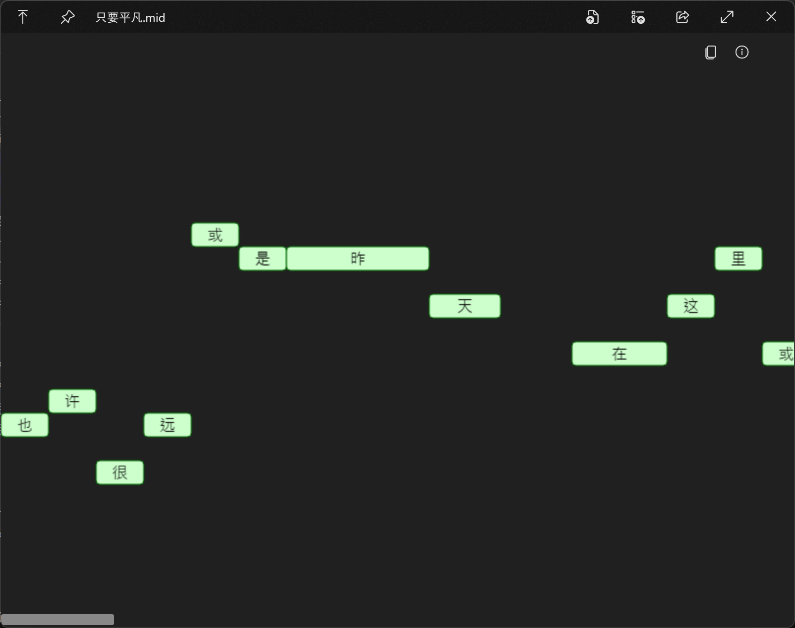

# QuickLook.Plugin.PianoRollViewer
A [QuickLook](https://github.com/QL-Win/QuickLook) plugin for various music creation formats that shows your file as piano roll.

Note: Currently this plugin only works on [QuickLook nightly](https://github.com/QL-Win/QuickLook/releases/tag/latest).



## Supported formats
The following file formats are currently supported:
- `.mid` or `.midi`: [MIDI](https://midi.org) file.
- `.svp`: [Synthesizer V](https://dreamtonics.com/synthesizerv/) project
- `.ust`: [UTAU](https://utau2008.xrea.jp/) project
- `.ustx`: [OpenUtau](https://github.com/stakira/openutau) project.

## Download and Installation

1. Go to [Release page](https://github.com/xunmengshe/QuickLook.Plugin.PianoRollViewer) and download the latest version.
2. Make sure that you have QuickLook running in the background. Go to your Download folder, and press <key>Spacebar</key> on the downloaded `.qlplugin` file.
3. Click the “Install” button in the popup window.
4. Restart QuickLook.

---
以下是原仓库的Readme.md

## 项目 Releases 迁移公告

由于需求的变更，本项目在创立之初的架构可能在未来无法满足需要，因此我们未来会重写底层框架，开发更加通用强大的歌声合成工程处理接口，探索全新的调音工作流。目前本项目的日常更新以及未来框架的搭建均会在组织账号 [@openvpi](https://github.com/openvpi) 下进行，届时也将欢迎更多开发者的加入，敬请关注。

项目成果现已公测：[B站专栏](https://www.bilibili.com/read/cv16468227)

日常发行版更新已移至：[OpenVPI 主页](https://openvpi.github.io/)

# OpenSVIP

基于 X Studio · 歌手工程文件（.svip）的歌声合成软件工程文件中介模型和转换框架


## 项目简介

本项目致力于建立一个主要基于 X Studio · 歌手 `.svip` 格式工程文件的中介表示模型和格式转换框架，并实现各类歌声合成软件的工程文件互相转换。通过开发适当的插件，任何格式都将能够接入框架并与框架内其他所有支持的文件格式互相转换。

本框架能够转换的内容将包括但不限于：

- 音轨信息
- 音符序列
- 歌词序列
- 参数（需要映射规则）

当前已经支持、正在开发和计划中的格式转换器：

- X Studio 工程文件 (*.svip)
- OpenSVIP 文件 (*.json)
- Synthesizer V 工程文件 (*.svp)
- 歌叽歌叽工程文件 (*.gj)
- Project Vogen 工程文件 (*.vog)
- MIDI 文件 (*.mid)
- 元七七编辑器工程文件 (*.y77)
- ACE Studio 工程文件 (*.acep)
- OpenUtau 工程文件 (*.ustx)（开发中）
- VOCALOID 3/4 工程文件 (*.vsqx)（开发中）
- Utau 工程文件 (*.ust)（[开发中](https://github.com/oxygen-dioxide/opensvip)）
- DeepVocal 工程文件 (*.dv)（计划中）
- VocalSharp 工程文件 (*.vspx)（计划中）

## 使用方法

### GUI 桌面应用程序

OpenSVIP 工程转换器已开启公测：详见 [OpenVPI 主页](https://openvpi.github.io/home/)

### C# 命令行工具

使用以下命令可以获得完整的使用指南：

```shell
OpenSvip.Console.exe --help
```

#### 运行环境要求

需要 .NET Framework 4.7.2 以上。运行部分插件可能需要满足其他要求，详见插件说明。

#### 工程文件转换

命令基本格式为：

```shell
OpenSvip.Console.exe -i <输入标识符> -o <输出标识符> <输入文件路径> <输出文件路径>
```

其中，输入和输出标识符用于指定所使用的插件。例如，将当前目录下的一个 `.svip` 文件转换为 OpenSVIP JSON 文件：

```shell
OpenSvip.Console.exe -i svip -o json test.svip test.json
```

此外，部分插件支持设定输入和输出选项。若要指定选项，需在命令中加入（以输入选项为例）：

```shell
--input-options <选项名>=<选项值>{;<选项名>=<选项值>}
```

例如，在转换为 `.json` 文件时指定输出带缩进的格式：

```shell
OpenSvip.Console.exe -i svip -o json test.svip test.json --output-options indented=true
```

在转换为 `.svip` 文件时指定输出版本为 SVIP6.0.0 (X Studio 1.8)，默认歌手为何畅：

```shell
OpenSvip.Console.exe -i json -o svip test.json test.svip --output-options version=6.0.0;singer=何畅
```

选项分为字符串、整数、浮点数、布尔值、枚举类型，且均具有默认值。具体选项内容由插件本身决定，详见各插件信息。

#### 查看插件信息

可以使用以下命令查看所有插件（包括其对应的标识符）：

```shell
OpenSvip.Console.exe plugins
```

使用以下命令查看某个插件的详细信息：

```shell
OpenSvip.Console.exe plugins -d <插件标识符>
```

### Python 开发工具

TODO
